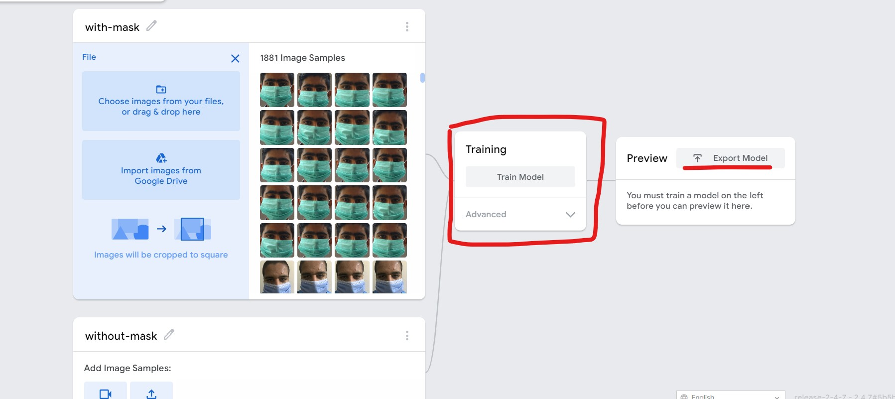

# Face Mask Classifier

## Repo Structure

```
    ├── docs                  # Contains project-related documents.
    ├── research              # Contains pre-research experiments.
    │   ├── pre-prototype       # Contains pre-prototype (basic project).
    │   ├── model.zip           # Contains trained model.
    ├── source                # Contains main source code.
    └── README.MD             # Contains GitHub Readme Content.

```

## Introduction

The Face Mask Classifier Prototype is a web application that classifies images as "with-mask" or "without-mask". This prototype showcases the integration of Teachable Machine for model training and TensorFlow.js for real-time inference directly within a web browser. Its primary function is classifying whether individuals wear face masks correctly based on webcam input. This project is a practical example of building and deploying a basic image classification system.

**Note:** This AI model was trained with TechableMachine, a No-Code AI platform used for educational purposes. However, it is not suitable for production or enterprise purposes due to its lower performance quality.

## Technology Stack

- HTML
- PHP
- CSS
- JavaScript
- TensorFlowJS

## Setup

**Step 01:** Install a web server

- [XAMPP](https://www.apachefriends.org/download.html) Server is recommended.

**Step 02:** Copy the 'source' / 'facemask-project' folder to the htdocs or public.

**Note:** Setting up this application is simple. It can be easily moved to a server and requires a server to function.

## Guide for AI Model Training (Techable Machine)

Teachable Machine is an innovative web-based platform developed by Google that empowers individuals, regardless of their coding experience, to delve into machine learning and artificial intelligence. This intuitive tool is a gateway for beginners and enthusiasts, allowing them to train their machine-learning models without extensive programming knowledge.

It is recognizing objects in images, identifying sounds, or classifying data. Teachable Machine simplifies the process by providing a user-friendly interface that enables users to teach their models through a simple demonstration process easily. This democratization of machine learning is transforming how people interact with AI, making it accessible and understandable to a broader audience and fostering creativity and innovation across various domains.

**Step 01:** Go to (https://teachablemachine.withgoogle.com)

**Step 02:** Click “Get Started Button”:


**Step 03:** Select “Image Project” and choose “Standard Image Model”:


**Step 04:** Collect Dataset: [Sample Face Mask Dataset](https://zenodo.org/record/6408603)

**Step 05:** Start Training



**Note:** After that, other steps are self-explanatory: create classes according to the needs; those could be “with-mask” and “without-mask,” then add data to the relevant classes and click train to start the training process. Apart from this, advanced settings can be changed to improve performance and accuracy. The model can be uploaded online or downloaded locally; it also provides basic code to infer the model in Python, a Web App (TensorFlow | TensorFlowJS | TensorFlow Litte).
