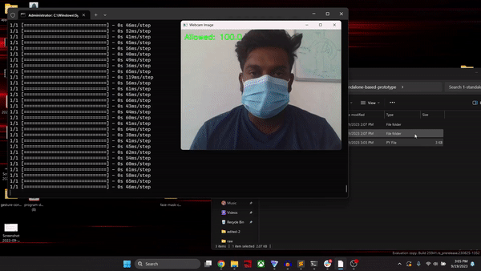

# Face Mask Classifier

## Repo Structure

```
    ├── docs                                # Contains project-related documents.
    ├── research                            # Contains pre-research experiments.
    │   ├── models                            # Contains trained models. 
    │   ├── pre-prototype                     # Contains pre-prototype (basic project).
    ├── source                              # Contains main source code.
    │   ├── 0-web-based-prototype             # Contains source code of the web-based app.
    │   ├── 1-standalone-based-prototype      # Contains source code of the standalone-based app.
    └── README.MD                           # Contains GitHub Readme Content.

```

## Introduction

The Face Mask Classifier Prototype is a web application that classifies images as "with-mask" or "without-mask". This prototype showcases the integration of Teachable Machine for model training and TensorFlow.js for real-time inference directly within a web browser. Its primary function is classifying whether individuals wear face masks correctly based on webcam input. This project is a practical example of building and deploying a basic image classification system.

**Note:** This AI model was trained with TechableMachine, a No-Code AI platform used for educational purposes. However, it is not suitable for production or enterprise purposes due to its lower performance quality.

## Technology Stack

- HTML
- PHP
- CSS
- JavaScript
- TensorFlowJS

## Setup

### Web App Prototype

**Step 01:** Install a web server

- [XAMPP](https://www.apachefriends.org/download.html) Server is recommended.

**Step 02:** Copy the 'source/0-web-based-prototype' folder to the htdocs or public.

**Note:** Setting up this application is simple. It can be easily moved to a server and requires a server to function.

### Demonstration


### Desktop App Prototype

**Step 01:** Install Python Dependencies

```
pip install tensorflow
```

```
pip install keras
```

```
pip install opencv-python
```

```
pip install playsound
```

**Step 02:** Run the main.py which in the "source\1-standalone-based-prototype" folder
```
python main.py
```

### Demonstration



## Train AI models with the Teachable Machine.

Teachable Machine is a Low-Code-AI tool that helps to train simple AI models to recognize images, sounds, & poses without coding experience. This tool is a gateway for beginners and enthusiasts, allowing them to train simple machine-learning models without extensive programming knowledge.

**Note:** Teachable Machine is not a good tool for developing enterprise applications; it can be used only for simple models and education purposes.

**Step 01:** Go to (https://teachablemachine.withgoogle.com)

**Step 02:** Click “Get Started Button”:


**Step 03:** Select “Image Project” and choose “Standard Image Model”:


**Step 04:** Collect Dataset: [Sample Face Mask Dataset](https://zenodo.org/record/6408603)

**Step 05:** Start Training


**Note:** After that, other steps are self-explanatory: create classes according to the needs; those could be “with-mask” and “without-mask,” then add data to the relevant classes and click train to start the training process. Apart from this, advanced settings can be changed to improve performance and accuracy. The model can be uploaded online or downloaded locally; it also provides basic code to infer the model in Python, a Web App (TensorFlow | TensorFlowJS | TensorFlow Litte).

# Contact

### Website: 

[](https://www.gunarakulan.info)

### Social Media:

[](https://www.linkedin.com/in/gunarakulangunaretnam)
[](https://www.facebook.com/gunarakulangunaretnam)
[](https://wa.me/94740001141?text=WhatsApp%3A%20%2B9740001141)
[](https://www.instagram.com/gunarakulangunaretnam)
[](https://x.com/gunarakulangr)
[](https://www.kaggle.com/gunarakulangr)
[](https://www.tiktok.com/@gunarakulangunaretnam)
[](https://www.youtube.com/channel/UCjMOdgHFAjAdBKiqV8y2Tww)
